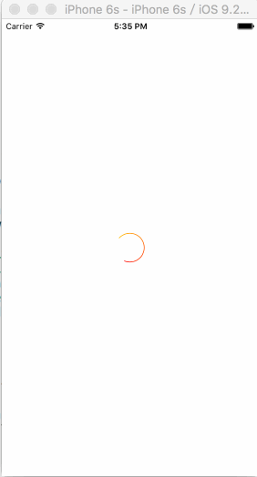

# TCLoadingView
> 一个有渐变动画效果的 loading

## 效果如下

## Demo
	[TCLoadingView setLineWide:1.0f];
    [TCLoadingView setStartColor:[UIColor redColor]];
    [TCLoadingView setEndColor:[UIColor yellowColor]];
    [TCLoadingView setAnimationDuration:0.5f];
    [TCLoadingView showWithView:self.view];
    或者
    [TCLoadingView showloadWithFrame:CGRectMake(100, 100, 100, 100)
                            lineWide:6.0f
                          startColor:[UIColor blueColor]
                            endColor:[UIColor whiteColor]
                            duration:1.0f
                                view:self.view];

### 代码参考
[WCGradientCircleLayer](https://github.com/wenchenhuang/WCGradientCircleLayer)
